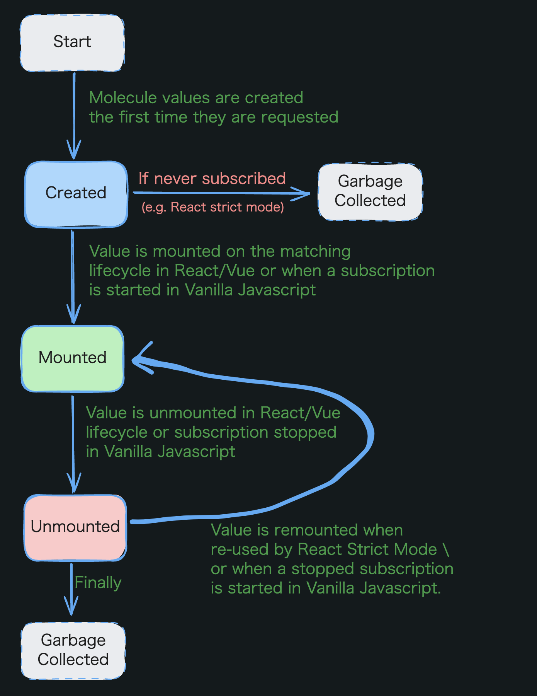

# bunshiを理解する

## はじめに

[bunshi](https://github.com/saasquatch/bunshi) というライブラリがある。状態管理ライブラリの DI を行うものだ。

`jotai` を使う機会があり、調べを進める中で当時名前を聞いた `jotai-molecule` が `bunshi` という名前で良い感じに開発されていて気になったので調べてみる。

注意: この記事が書かれた当時の情報であり、最新の情報とは異なる可能性がある。`bunshi` のバージョンは `2.1.5` である。

## bunshiの特徴

`bunshi` は次のような特徴を持つ。

### バンドルサイズが小さい

gzip 圧縮されたサイズで 1.18KB しかない。また他のライブラリに依存いていないのも大きな特徴だ。

### framework agnosticである

`bunshi` は `jotai` や `zustand`、`nanostores` などの状態管理ライブラリを `molecule` という概念でラップすることで、状態のスコープ管理や依存注入を行うことができる。

`molecule` の宣言は framework agnostic であるため、ロジックをフレームワークに依存させず書くことができる[^1]。

[^1]: `React` と `Vue` は専用の API が用意されている。詳しくはこちらを参照。[React](https://www.bunshi.org/integrations/react/)、[Vue](https://www.bunshi.org/integrations/vue/)

### パフォーマンスに配慮されている

`WeakMap` を用いたメモリリークの防止[^2]や、不要な再レンダリングを防止するためにフレームワークのインテグレーション(`React`, `Vue`)ではメモ化を行っている。

[^2]: [Why WeakMap?](https://developer.mozilla.org/en-US/docs/Web/JavaScript/Reference/Global_Objects/WeakMap#why_weakmap)

## bunshiの基本概念

bunshi は次の 3 つの概念で構成される。

### molecule

`molecule` は `bunshi` の core 的な概念であり、実態は値を返す関数の HoF である。

最大の特徴は、関数の実行結果がキャッシュされることである。以下の例は常に同じ乱数を返す。

```ts:sample.ts
import { molecule } from "bunshi";

export const RandomMolecule = molecule(() => Math.random());
```

また `molecule` は他の `molecule` に依存できる。

```ts:sample.ts
import { molecule } from "bunshi";

export const RandomMolecule = molecule(() => Math.random());
export const UsernameMolecule = molecule(
	mol => `You are user ${mol(RandomMolecule)}`,
);
export const IDMolecule = molecule(mol => `ID: ${mol(RandomMolecule)}`);
```

依存は自動で解決されるため、コード保守やテストが容易になる。

ロジックなどを `molecule` に閉じ込めることでコードは非結合で遅延的となる。

- 非結合

  - ある `molecule` をリファクタリングする時、その `molecule` に依存する他の `molecule` に影響を与えない

- 遅延的

  - `molecule` は必要になるまで実行されない

### scope

`scope` は `molecule` を異なるコンポーネントで共通の環境を共有して使うための依存関係のグラフを構築するための概念である。

`createScope` 関数を使って `scope` を作成する。

```ts:sample.ts
import { createScope } from "bunshi";

/**
 *  Scope for a user id
 */
export const UserScope = createScope<string>("alice@example.com");
```

宣言した `scope` はフレームワークによって異なる方法でプロバイダーを提供する。私は `React` を使っているので、`React` でのプロバイダーの提供方法を示す。

```tsx:sample.tsx
import { ScopeProvider } from "bunshi/react";
import type { ReactElement } from "react";

import { UserScope } from "./scopes";

export function App({ children }: Props): ReactElement {
	return (
		<ScopeProvider scope={UserScope}>
			{children}
		</ScopeProvider>
	);
}
```

`scope` の真価は、`molecule` を `scope` に依存させることで発揮する。

```ts:sample.ts
import { molecule } from "bunshi";
import { UserScope } from "./scopes";

export const UsernameMolecule = molecule(
	(_mol, scope) => `You are user ${scope(UserScope)}`,
);
```

`scope` を `molecule` に依存させることで `molecule` はアプリケーション全体で 1 回実行されるのではなく、`scope` をマウントするごとに再実行される。また、`scope` に渡した値は `scope` プロバイダー内部の `molecule` から `scope()` 関数を通じて取得できる。

### lifecycle

`molecule` はアプリケーションやスコープに応じて必要なときに実行され使用中であることを示すためマウントされ、必要でなくなったらアンマウントされ GC される。

以下の図は [公式のドキュメント](https://www.bunshi.org/concepts/lifecycle/) から引用したものである。とてもわかりやすい。



次の例のように `onMount` 関数とその cleanup 関数を使って `molecule` のマウントとアンマウント時の処理を行うことができる。

```ts:sample.ts
import { molecule, onMount } from "bunshi";
import { atom } from "jotai/vanilla";

export const CountMolecule = molecule(() => {
	console.log("Created");
	onMount(() => {
		console.log("Mounted");
		return () => console.log("Unmounted");
	});
	return atom(0);
});
```

次にライフサイクルの各ステップについて説明する。

#### Created

アプリケーションが初期化された時、`scope` を登録したプロバイダーがマウントされた時などに `molecule` の値は作成され、すべての値は GC 可能になる。

#### Mounted

`molecule` の値は実行されただけではキャッシュされない。`React` や `Vue` では `useMolecule` フックを使用して `molecule` をマウントすることでキャッシュされる。

#### Unmounted

`molecule` の値が使用されなくなると、`molecule` はアンマウントされ、GC される。`React` や `Vue` では `useMolecule` フックで自動的にアンマウントされる。

React Strict mode を使用している方は unmount された後に再度 mount されることがあるので、この点に注意が必要である。`useEffect` などのフックの正当性を確認するために 2 回実行されるのと同じように、`molecule` も 2 回実行されることがある。この時、`mount -> unmount -> mount` の順番で実行される。

## 個人的に面白いと思ったポイント

`MoleculeInjector`(を生成する `createInjector`)と `moleculeInterface` だ。

https://www.bunshi.org/reference/vanilla/functions/functionmoleculeinterface-1/

https://www.bunshi.org/reference/vanilla/type-aliases/type-aliasmoleculeinjector/

それぞれ `bunshi` の依存関係のグラフを構築するための DI コンテナと、他の `molecule` が依存できるための参照を提供するものだ。ドキュメントにある通り、どちらも `molecule` や `useMolecule` の裏で使用されておりユーザーがこれらを直接使用するのはテストコードを書く場合やライブラリとして `molecule` を提供する場合などに限られる。

私がこれらの機能を面白いと感じたのは、今まで TS の DI コンテナと言われると、[NestJS](https://nestjs.com/) に乗っかるか、[TSyringe](https://github.com/microsoft/tsyringe) であった。前者はバックエンドを構築するためのフレームワークなので、そもそもフロントエンド文脈で使うことがない。また TSyringe は DI コンテナとしては良くできている。循環依存やインスタンスを使い捨てるなどができるが、デコレータを使用する必要があり `reflect-metadata` を使う制約がある[^3]。

その点 `bunshi` はスコープで分けられていて、かつ自動で DI される仕組みをとても気に入っている。

[^3]: `reflect-metadata` はバンドルに含めるとサイズが大きくなるため、筆者はあまり使いたくない。

## 結局何が嬉しい？

`bunshi` を使うことで、ステートのリフトアップやプッシュダウンを容易に実現できる。以下の 2 つの例を見れば一目瞭然であると言える。

```tsx:sample.tsx
import { atom, useAtom } from "jotai";

function createAtom(userId: string) {
	return atom(userId === "bob@example.com" ? 0 : 1);
}

const CountAtomContext = React.createContext(createAtom("bob@example.com"));
const useCountAtom = () => useContext(CountAtomContext);
function CountAtomScopeProvider({ children, userId }) {
	// Create a new atom for every user Id
	const countAtom = useMemo(() => createAtom(userId), [userId]);
	return (
		<CountAtomContext.Provider value={countAtom}>
			{children}
		</CountAtomContext.Provider>
	);
}

function Counter() {
	const countAtom = useCountAtom();
	const [count, setCount] = useAtom(countAtom);
	return (
		<div>
			count:
			{" "}
			{count}
			{" "}
			<button onClick={() => setCount(c => c + 1)}>+1</button>
		</div>
	);
}

export function App() {
	return (
		<CountAtomScopeProvider userId="bob@example.com">
			<Counter />
			<Counter />
			<CountAtomScopeProvider userId="tom@example.com">
				<Counter />
				<Counter />
			</CountAtomScopeProvider>
		</CountAtomScopeProvider>
	);
}
```

上記の例は `jotai` を使っているが、`bunshi` も使うと以下のように書くことができる。

```tsx:sample.tsx
import { atom, useAtom } from "jotai";
import {
	ScopeProvider,
	createScope,
	molecule,
	useMolecule,
} from "bunshi/react";

const UserScope = createScope(undefined);
const countMolecule = molecule((mol, scope) => {
	const userId = scope(UserScope);
	console.log("Creating a new atom for", userId);
	return atom(0);
});

// ... Counter unchanged

export function App() {
	return (
		<ScopeProvider scope={UserScope} value="bob@example.com">
			<Counter />
		</ScopeProvider>
	);
}
```

## まとめ

今回は `bunshi` というライブラリの基本概念からその魅力までを調べた。途中で実装の方を参照することが多々あったが、ほとんどテストされていてドキュメントも充実しているため、理解するのは難しくなかった。

`bunshi` を使って状態管理のベストプラクティスを追求したいと思った。
