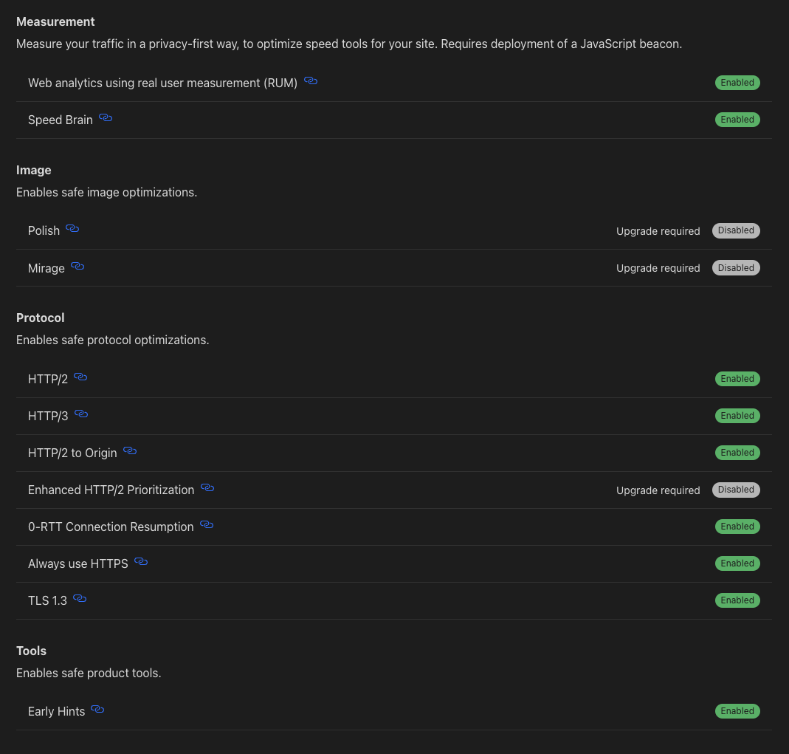
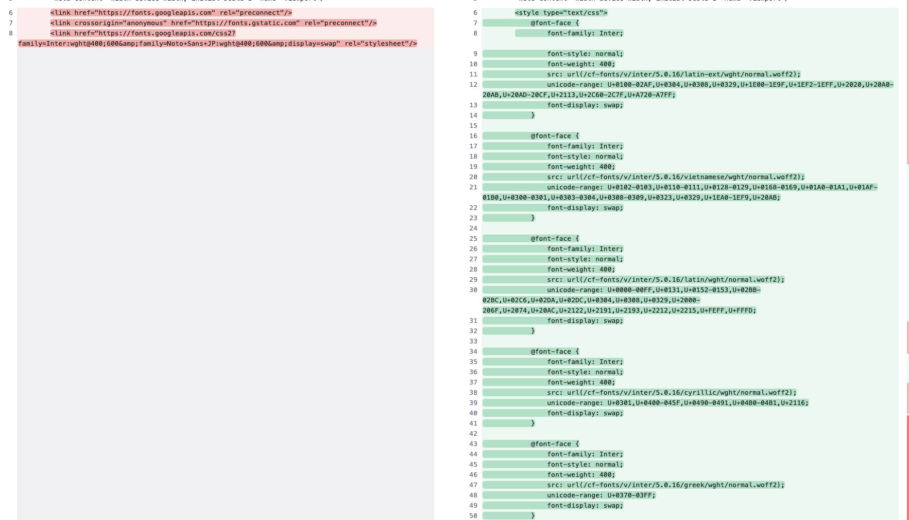

# Cf pages と Hydration Error

## はじめに

Cloudflare Pages で custom domains を割り当てたところ、hydration error が発生するようになった。この記事ではその解決方法を記す。

## 解決の糸口となった記事

https://medium.com/@Shivam010/cloudflare-pages-and-react-hydration-problems-only-on-custom-domain-957f5598ebe8

この記事では、 hydration error が起こった理由を Email Address Obfuscation という Cloudflare のサービスが website で有効化されており、それが原因であると指摘している。

## Cloudflare で設定できる最適化一覧

以下が Cloudflare で設定できる最適化の一覧である。



今回この問題に直面して調査した結果、この一覧にはある共通点があることに気づいた。

それは、Cloudflare から配信される HTML に対して変更を加えないものたちであることだ。[^1]

[^1]: 正確には、[Speed Brain](https://developers.cloudflare.com/speed/optimization/content/speed-brain/) と呼ばれる機能は Speculation Rules API によって実現されているため、本来は script tag が埋め込まれるはずだが、現状は埋め込まれていない。

## 配信している HTML に変更を加える最適化達

以下の最適化は、Cloudflare から配信される HTML に変更を加えるものである。

### Cloudflare Fonts

オリジンから返却される HTML を CDN 上で解析し、`<link href="https://fonts.googleapis.com...省略" rel="stylesheet">` に書かれている CSS をブラウザではなくエッジ上でダウンロードする。
そして、その CSS の内容を head にインラインのスタイル `<style>` として書き込んでから、ブラウザに HTML を返却する。

以下がその例である。



### Rocket Loader

Rocket Loader は、ページの読み込みを高速化するために、ページ上の JavaScript の読み込みをレンダリング後まで延期する。
それにより、ウェブサイトのコンテンツ（テキスト、画像、フォントなど）を優先的に読み込むことができる。

以下のような script tag が埋め込まれる。

```html:index.html
<script src="/cdn-cgi/scripts/7d0fa10a/cloudflare-static/rocket-loader.min.js" data-cf-settings="78debd8b89ee77d3369ad146-|49" defer></script>
```

## HTML の書き換えにより起こる問題

Cloudflare から配信される HTML が書き換えられることにより、hydration error が発生する。

これは SSR した HTML が使われずに CSR が行われることを意味する。

以下のようなフローをたどり、最終的にブラウザ上に表示されるため CLS が発生してしまう。

hydration 前の SSR された HTML --> CSR される --> hydration される

## まとめ

Cloudflare で配信される HTML に変更を加える最適化は、React の hydration に影響を及ぼす可能性がある。ダッシュボードでトグルをオンにするだけで手軽に最適化を行えるが、大いなる力には大いなる責任が伴う[^2]ことを忘れてはならない。

[^2]: [大いなる力には、大いなる責任が伴う - ピクシブ百科事典](https://dic.pixiv.net/a/%E5%A4%A7%E3%81%84%E3%81%AA%E3%82%8B%E5%8A%9B%E3%81%AB%E3%81%AF%E3%80%81%E5%A4%A7%E3%81%84%E3%81%AA%E3%82%8B%E8%B2%AC%E4%BB%BB%E3%81%8C%E4%BC%B4%E3%81%86)
